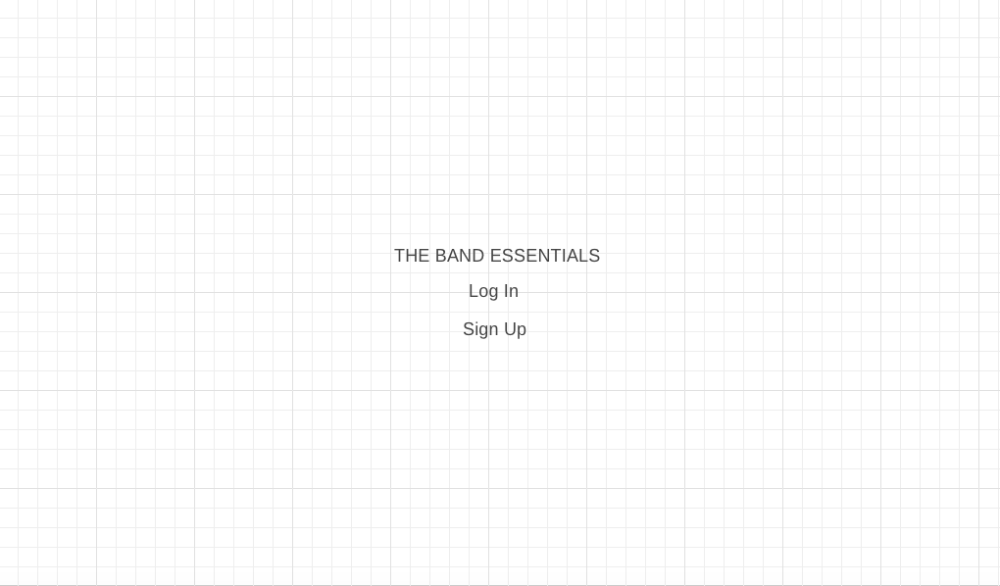
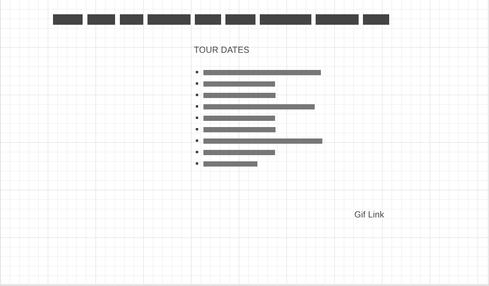
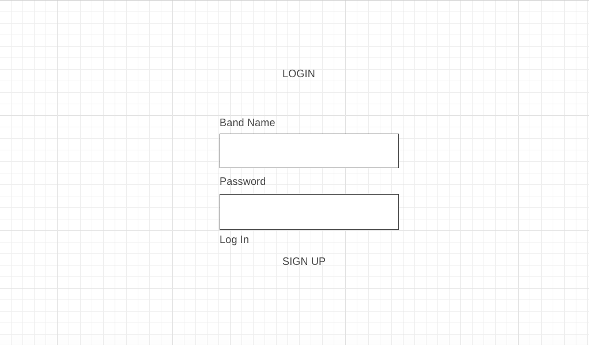
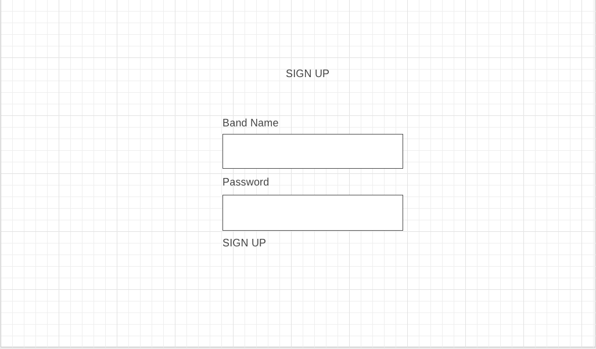
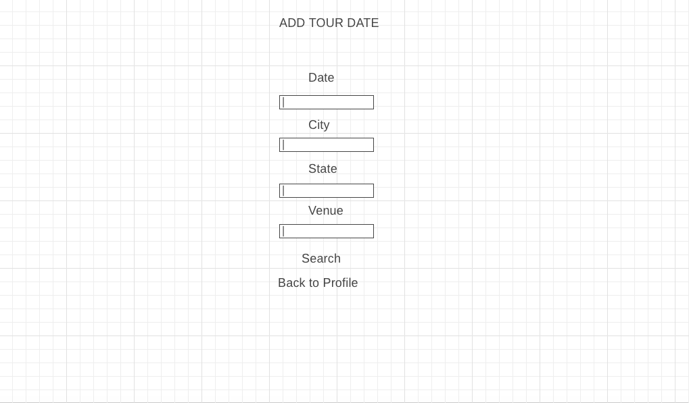
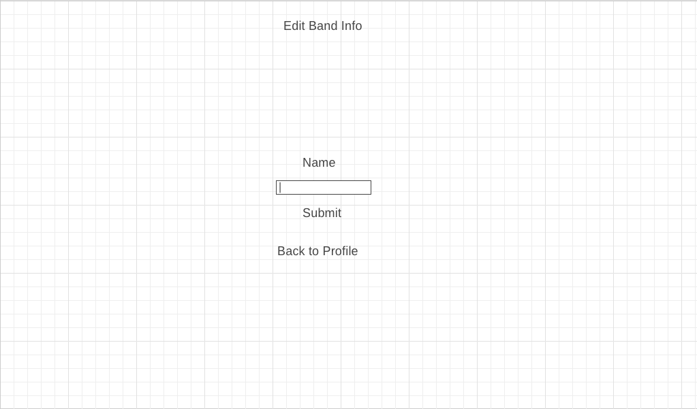
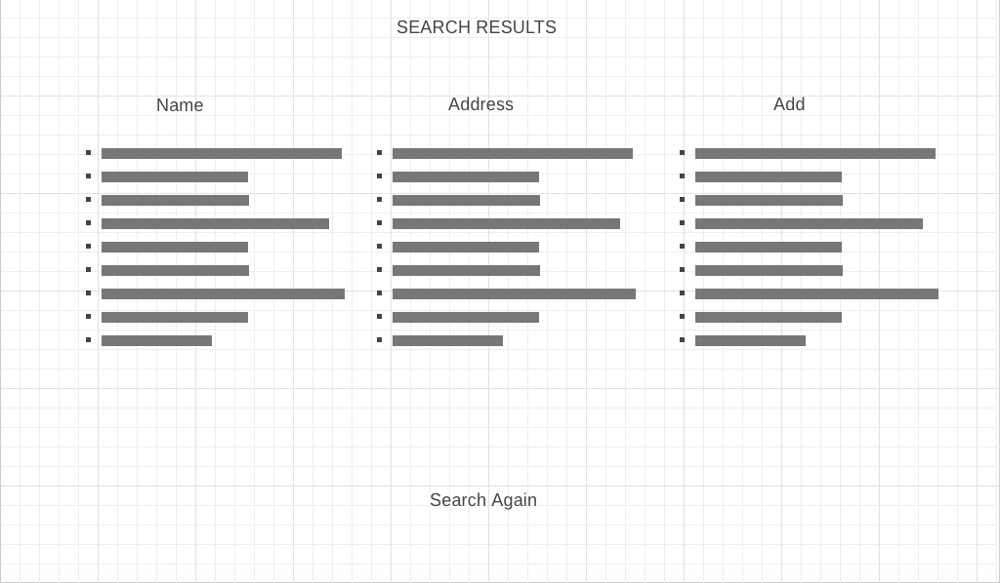
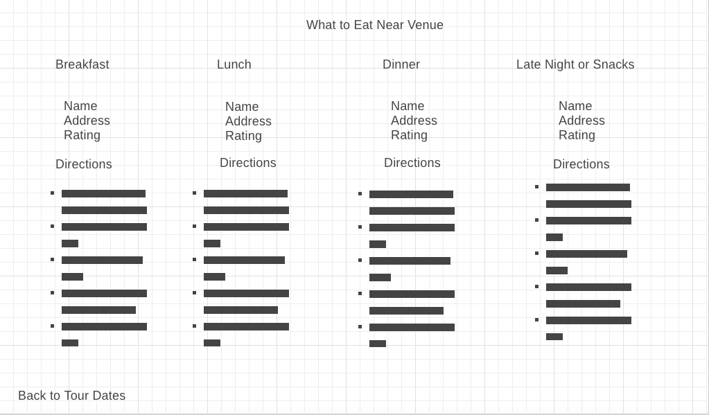

# The Band Essentials

## Synopsis

This is a full stack app for bands on the run!  It provides a way for bands to keep track of their tour dates and have useful food information for each stop of the tour.  The app makes use of MVC modeling, using a local database to store info on bands, venues, and tour dates, and accesses Google Places' external API.  Bands can create accounts using an encrypted password; add, edit, and delete tour dates; and find breakfast, dinner, lunch, and snack options nearby each venue.

## User Stories

* As a touring musician I want to be able to find great places to eat around the venues I play.
* As a local musician I want to be able to provide advice for touring bands looking for places to eat.
* As a venue booking agent/manager I want to be able to provide my touring bands with a tool to find the best places to eat around the venues they play.

## Requirements

Several npm packages are needed for this app to work:

axios
bckryptjs
body-parser
connect-flash
cookie-parser
dotenv
express
express-session
flatpickr
giphy-api
morgan
mustache-express
passport
passport-local
pg-promise

To install these, first go to your source directory and use 'npm install' and then 'npm init' to initialize npm.  Then type 'npm install --save [package name]' for each of the ones listed above.

You will also need a Google API key, which you can get [here](https://developers.google.com/places/web-service/get-api-key).

Create a .env file and store your key as "GOOGLE_ID".

Once everything is set up, use localhost:8080 as the url, and run 'nodemon -e html,css,js' in your terminal.

## Public Location

The app can be accessed at https://bandessentials.herokuapp.com/

## Motivation

This is a project assigned for unit 2 of Web Development Intensive at General Assembly.  We were tasked with creating a full stack app utilizing local databases, RESTful routes, and external API calls.  I decided to create something that I'd actually want to use as an (occasionally) touring musician, and to solve a real problem.  While the app currently hard codes the query parameters for each restaurant search, it is built in a way that could scale for more robust searching if needed.

## Wireframes

Landing Page:

Profile Page:

Login Page:

Sign Up Page:

Add Date Page:

Edit Date Page:

Edit Name Page:

Search Results Page:

Venue Page:

## Approach

The app required a lot of moving pieces and a fairly extensive structure setup.  To start, I set up my file structure (index, models/services, views, and controllers) and installed the necessary packages.  To set up user authentification, I utilized a structure implemented in the General Assembly WDI class.

After getting that working, I went about building out all the RESTful routing.  This included paths for creating and editing users (bands), and creating, editing, and deleting tour dates.  I at first seeded a local db and utilized only local data.

Once this was set up, I created a path for searching for venues.  Again, I hard coded everything to start in order to leave API calls until the end.  Basic info from each venue was to be saved in the local database as well.

At this point, all paths worked, and it was time to bring in the Google Places API.  After getting my key, I set up API url calls that queried user input for venues.  Using this data, I was able to tie a verified venue in my local database to a tour date which referenced a band as well.  I then set up calls to the API which would search for breakfast, lunch, dinner, and snacks nearby that venue, and render that information on a page.  Finally, I added a Google map link that would give the user directions from the venue to the restaurant.

The last step was to style the html and comment up my code.

## Unsolved Problems

From a functional standpoint, there are not many issues.  Since I wasn't super familiar with the ins and outs of the authentification process, I did not get around to preventing duplicate band names.  Sorting restaurant data by rating was another reach goal I did not have time for, nor was I able to built out a very robust search feature.

## Presentation

[Link](https://docs.google.com/presentation/d/1X8mTnI7ln7b4ISYvWCbRG4OoicRRB8asmQMUclXwexA/edit?usp=sharing)